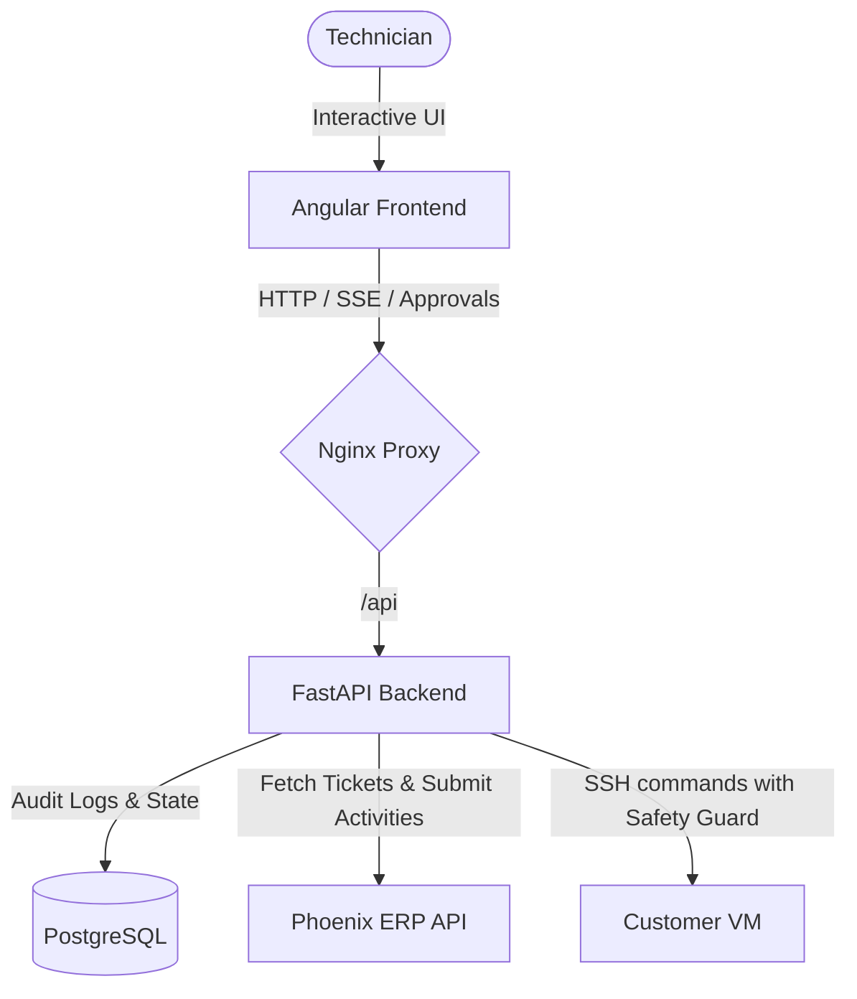

# techbold · AI Service Desk Autopilot

An AI-assisted technician workspace that connects to customer VMs over SSH to diagnose and resolve IT incidents. Under strict human-in-the-loop control, the agent proposes commands, validates its fixes, and logs completed work back to the Phoenix ERP.

---

## 🛠️ Stack & Technologies

- **Frontend**: Angular 22 SPA (served via Nginx proxy)
- **Backend**: FastAPI (Python 3.11+)
- **LLM Agent**: Pydantic-AI (OpenAI / Azure OpenAI models)
- **SSH Client**: Fabric & Paramiko
- **Database**: PostgreSQL (SQLAlchemy ORM + asyncpg)
- **Reverse Proxy**: Nginx (orchestrates local routing and API proxying)

---

## 🏗️ Architecture



### Key Workflow
1. **Ingest**: The backend pulls assigned ticket info and SSH access details from **Phoenix ERP**.
2. **Diagnosis & Propose**: The **Pydantic-AI Agent** starts a diagnostic process. It generates commands to run on the target VM.
3. **Safety & Whitelist**: 
   - Read-only queries (e.g. `ls`, `status`) are automatically matched against a database whitelist and auto-executed.
   - Write/Modifying commands halt and await manual technician approval via the frontend.
   - Built-in `CommandSafetyGuard` blocks destructive patterns (e.g., `rm -rf /`, `chmod -R 777`) before network transmission.
4. **Execution**: Safe, approved commands execute on the customer VM via SSH. Audit logs are persisted in PostgreSQL and streamed live to the frontend.
5. **Closeout**: The agent runs a local validation script (`/opt/hackathon/public-test.sh`) on the target VM, formats an activity summary using the LLM, updates the ticket to `DONE` in the ERP, and submits the activity log.

---

## 🚀 Getting Started (Docker)

Docker Compose is the recommended way to run the entire stack (Frontend, Backend, and Database).

### 1. Prerequisites
- **SSH Private Key**: Ensure you have the `.pem` key files in the `keys/` folder for accessing the customer VMs.
- **LLM Credentials**: Bring-your-own OpenAI/Azure OpenAI credentials.

### 2. Configuration
1. Copy the example environment template:
   ```bash
   cp .env.example .env
   ```
2. Edit `.env` and fill in:
   - `PHOENIX_API_BASE_URL` & `PHOENIX_API_TOKEN` (ERP credentials)
   - `POSTGRES_PASSWORD` (database password)
   - `OPENAI_API_KEY` (LLM access)
3. Copy your SSH key file into the `keys/` directory:
   ```bash
   cp /path/to/your-key.pem keys/your-key.pem
   ```

### 3. Run the Stack
Start all services in detached mode or attached logs:
```bash
docker compose up --build
```

- **Frontend Workspace**: http://localhost (port 80)
- **Backend API Docs**: http://localhost:8000/docs

---

## 💻 Local Development (Without Docker)

### Backend
```bash
cd backend
python -m venv .venv && source .venv/bin/activate
pip install -r requirements-dev.txt
uvicorn app.main:app --reload
```
*Note: Make sure to point `DATABASE_URL` in `.env` to `localhost` instead of the Docker service name `postgres`.*

### Frontend
```bash
cd frontend
npm install
npm run start
```
*Runs the Angular dev server on http://localhost:4200.*

---

## 🧪 Testing

### Backend Unit & Integration Tests
```bash
cd backend
pytest
```
*All tests run locally using mocks, meaning no active database or Phoenix ERP instances are required.*
